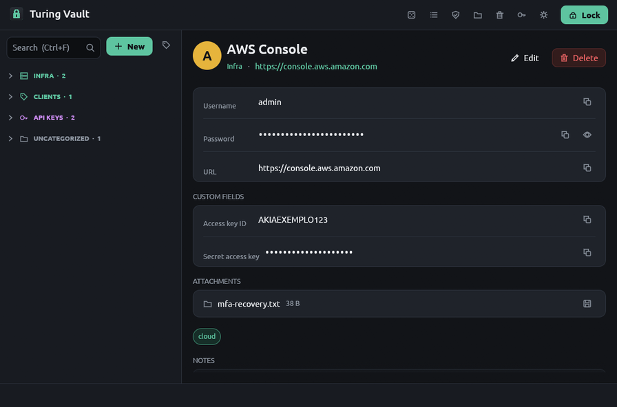
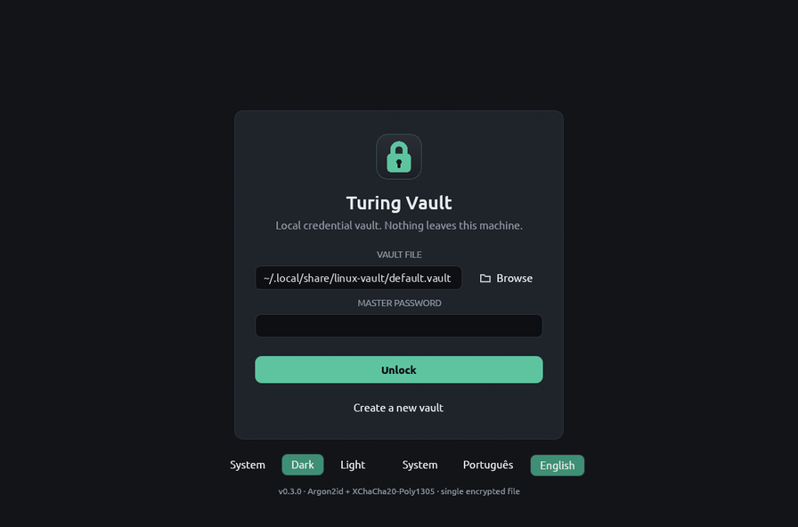
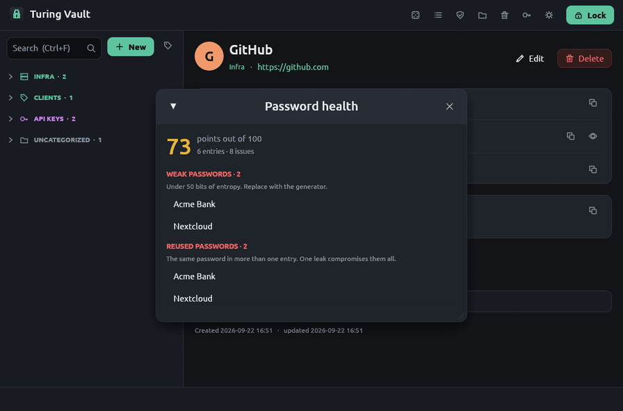
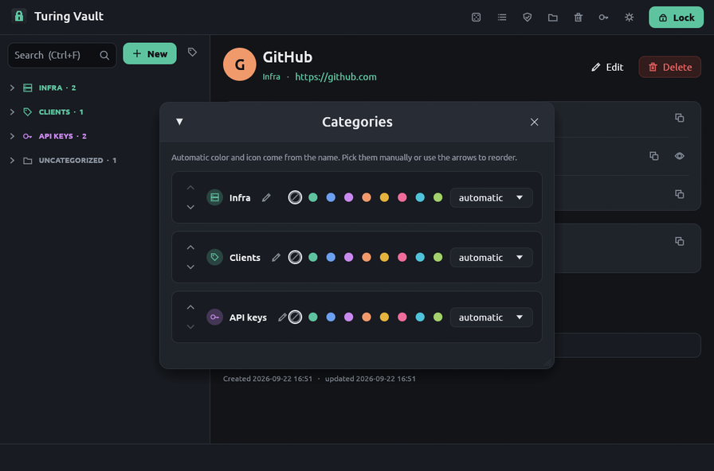
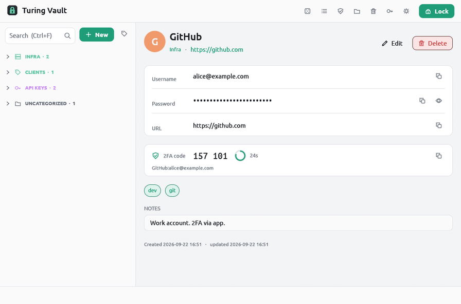

<p align="center">
  
</p>

<h1 align="center">Turing Vault</h1>

<p align="center">
  A local, encrypted credential vault for Linux. One file, one master password, nothing leaves your machine.<br>
  <a href="#português">Português abaixo</a>
</p>

<p align="center">
  <a href="https://github.com/gitmonox/turing_vault/releases/latest"></a>
  
  
</p>

<p align="center">
  
</p>

## Install

Download the `.deb` from the [latest release](https://github.com/gitmonox/turing_vault/releases/latest) and run:

```bash
sudo apt install ./linux-vault_*_amd64.deb
```

Open **Turing Vault** from your app menu. Updates are offered inside the app and verified with an Ed25519 signature before installing. Your vault, PIN and settings are preserved across updates.

Every release ships with a `.sig` (Ed25519 signature) and a `.sha256`. The public key is embedded in the app.

## What you get

| | |
|---|---|
| **Everything encrypted** | Argon2id derives the key from your master password; entries, notes, custom fields and attachments are sealed with XChaCha20-Poly1305 in a single file. Tampering is detected. |
| **Fast unlock** | Optional 6-digit PIN per machine, backed by the system keyring. Five wrong attempts disable it. |
| **2FA built in** | Store TOTP secrets (or the `otpauth://` URI) and copy the current code with a countdown. |
| **Quick search anywhere** | `Super+Shift+V` opens a search box over any app; `Enter` copies the password, `Ctrl+Enter` the 2FA code. The clipboard clears itself afterwards. |
| **Organized** | Categories with colors and icons, tags, notes, custom fields, attachments up to 5 MB, and a Note type for data that is not a password. |
| **Safe by default** | Auto-lock on inactivity, trash with 30-day retention, encrypted audit log, password health report, encrypted backups, CSV import from Bitwarden, KeePass and browsers. |
| **Yours** | Dark and light themes, Portuguese and English, system tray, keyboard shortcuts. No account, no server, no telemetry. |

<p align="center">
  
  
</p>
<p align="center">
  
  
</p>

## Verify a download

```bash
sha256sum -c linux-vault_*_amd64.deb.sha256
```

The `.sig` file is the Ed25519 signature the app itself checks before installing an update.

## Requirements

Ubuntu 22.04 or newer, Debian 12 or newer, amd64. Works on X11 and Wayland. The tray icon needs a StatusNotifier host (GNOME ships the AppIndicator extension; KDE has it built in).

---

<h2 id="português">Português</h2>

Cofre local de credenciais para Linux: um arquivo cifrado, uma senha-mestra, nada sai da sua máquina.

**Instalar:** baixe o `.deb` na [última versão](https://github.com/gitmonox/turing_vault/releases/latest) e rode `sudo apt install ./linux-vault_*_amd64.deb`. O app avisa quando há versão nova e instala com um clique, verificando a assinatura antes. Vault, PIN e configurações são preservados.

**O que tem:** tudo cifrado com Argon2id e XChaCha20-Poly1305; PIN de 6 dígitos por máquina; códigos 2FA; busca rápida em qualquer aplicativo com `Super+Shift+V`; categorias com cores e ícones, tags, campos personalizados e anexos; auto-lock, lixeira de 30 dias, auditoria cifrada, relatório de saúde das senhas, backup cifrado e importação de CSV; temas escuro e claro; português e inglês. Sem conta, sem servidor, sem telemetria.

**Requisitos:** Ubuntu 22.04 ou mais novo, Debian 12 ou mais novo, amd64.

---

<p align="center"><sub>© 2026 Bruno Tangerino. All rights reserved. Binaries only; source is not published.</sub></p>
